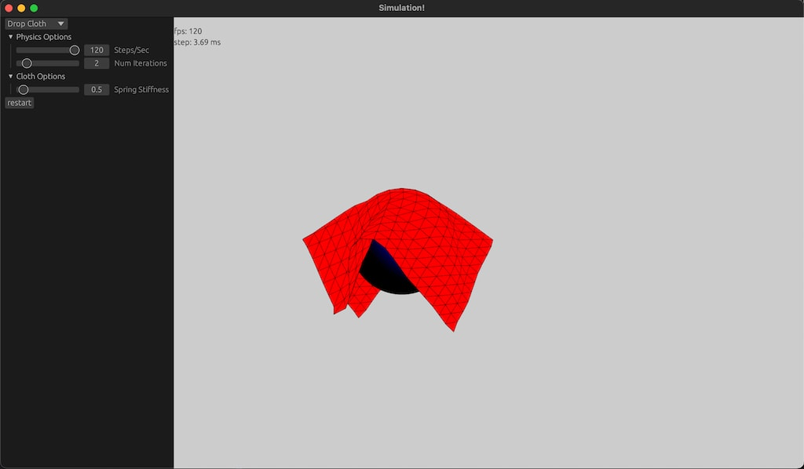

# 仓库介绍

- 主要目的: 随缘复现感兴趣的物理仿真论文
- 技术特性: 纯rust实现

# Crate介绍

- simulation - 仿真基础模块
- fast_mass_spring - 顾名思义，fast mass spring solver的实现
- visual-examples - 一些仿真demo，集成了渲染

# Docs

- [Fast Mass Springs](./docs/fast-mass-spring.md)

# Build and Run

```sh
cd visual-examples
cargo run --release
```

# Screenshots

